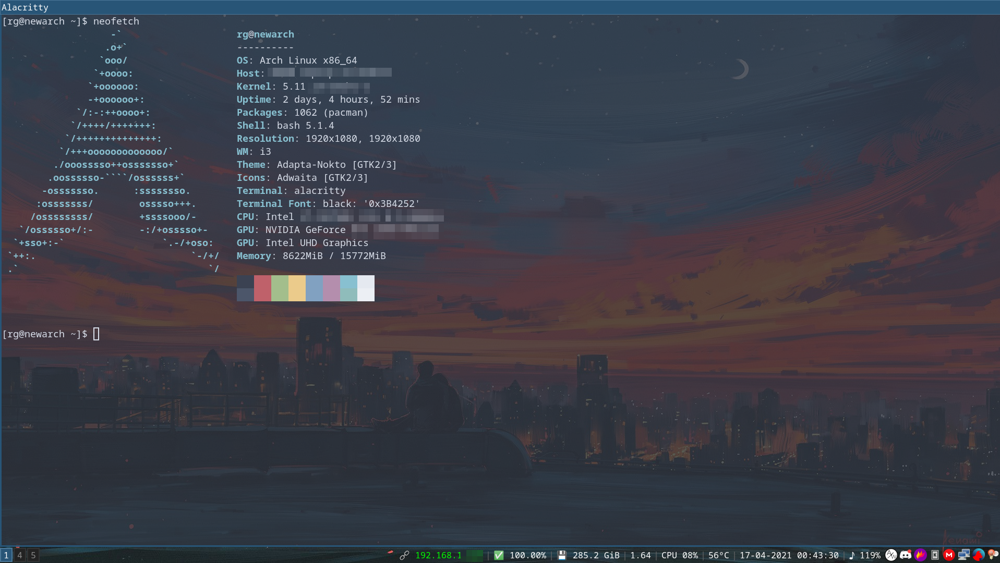

# Rafael's Dotfiles

These are the dotfiles for my Nord Theme-centric Arch Linux setup.

## Installation

Clone the repo and use stow (or create symlinks) to link to the correct directories.

### Wayland
Sway/Wayland files are included but incomplete and on-hold until Wayland/Sway become more mature for use with my system.
Expect everyting to be X-centric for now.

## Packages

The following packages were used:

| Name                                                                  | Package Manager                                                                 | Description                         | Used for                                 |
| :-------------------------------------------------------------------- | :------------------------------------------------------------------------------ | :---------------------------------- | ---------------------------------------- |
| `i3-gaps`                                                             | `yay`                                                                           | Window Manager                      | Desktop Environment                      |
| `i3lock-color`                                                        | `yay`                                                                           | Lockscreen                          |                                          |
| `py3status`                                                           | `pacman`                                                                        | Feeds info into i3's status bar     |
| `rofi`                                                               | `pacman`                                                                        | App Launcher                        |                                          |
| `picom-git`                                                           | `yay`                                                                           | Compositor for X11                  | i3bar and Alacritty transparency         |
| `inter-font`                                                          | `pacman`                                                                        | Font                                |                                          |
| `acpilight`                                                           | `yay`                                                                           | Brightness control keybinds         |                                          |
| `alsa-utils`, `pulseaudio`, `pulseaudio-alsa`, `pulseaudio-bluetooth` | `pacman`                                                                        | Audio support                       | Audio Management                         |  |
| `nordic-theme-git`                                                    | `yay`                                                                        | Dark mode GTK Theme                 | Theming for Nemo/GTK apps                |
| `papirus-icon-theme` | `pacman` | Material design Icons | GTK Icons
| `lxappearance`                                                        | `pacman`                                                                        | GTK Theme/Icon Manager              |
| `deadd-notification-center-bin`                                       | `yay`                                                                           | Notification Displayer              |
| `discover-overlay`                                                    | `yay`                                                                           | Discover Overlay                    |
| `noisetorch`                                                          | [`manually.`](https://github.com/lawl/NoiseTorch#third-party-packages-like-aur) | Image viewer                        |
| `eog`                                                                 | `pacman`                                                                        | Image viewer                        |
| `nitrogen`                                                            | `pacman`                                                                        | Wallpaper Manager                   |                                          |
| `flameshot`                                                           | `pacman`                                                                        | Screenshot tools                    |                                          |
| `xorg-xprop`                                                          | `pacman`                                                                        | Property displayer for X            | Awesome custom titlebars for each client |
| `imagemagick`                                                         | `pacman`                                                                        | Image viewing/manipulation          |                                          |
| `redshift`                                                            | `pacman`                                                                        | Color temperature of display        |                                          |
| `upower`                                                              | `pacman`                                                                        | Battery CLI tool                    |                                          |
| `noto-fonts-emoji`                                                    | `pacman`                                                                        | Google Noto emoji fonts             | Emoji characters on py3status            |
| `nerd-fonts-cjk`                                                      | `yay`                                                                           | Kaomoji support                     | Rofi unicode font                        |
| `ffmpeg`                                                              | `pacman`                                                                        | Video recorder, converter, etc      |                                          |
| `nemo`                                                                | `pacman`                                                                        | File explorer                       | File explorer                            |
| `alacritty`                                                           | `pacman`                                                                        | Terminal                            | Default Terminal Emulator                |  |  |
| `playerctl`                                                           | `pacman`                                                                        | Media Player Controller             | Keyboard media keys                      |
| `spicetify-cli-git`                                                   | `yay`                                                                           | Spotify Customization               | Applying themes to Spotify               |
| `neovim-nightly-bin`                                                              | `yay`                                                                           | Vim replacement                     | Use with VSCode extension                        |
| `python-pygame`                                                       | `pacman`                                                                        | Add sound to Pommodoros             | Add  a ring to Pommodoro in i3's bar     |
| `xcalib`                                                              | `pacman`                                                                        | Set ICC Calibration Profiles        | Color optimization on Laptop screen      |
| `polkit-gnome` | `pacman` | Gnome Authentication Agent | Polkit access agent
| `udiskie` | `pacman` | `Automatically mount USB drives`
| `aw-client` | [`manually.`](https://github.com/ActivityWatch/aw-client) | `Display total screen time on i3bar` | py3status module 
| `i3-workspace-names-daemon` | `pip` | Dynamic workspace icons | i3bar
| `duf` | `yay` | Pretty 'df' alternative | 

## Files you should edit right away
- If forking this you probably won't want most of what's in my startup.sh and .bashrc , you should edit those before stowing
- Also delete the symlinks in bin since those probably don't interest you as well

## Credits

- Inspired by [Diogo Correia's dotfiles](https://github.com/diogotcorreia/dotfiles)
- I stole the wallpapers from reddit a long time ago, if you know who to credit let me know :(
- Pomodoro alarm taken from [srikanthkanjarla's Pomodoro Timer](https://github.com/srikanthkanjarla/pomodoro-timer)
- Rofi Configs taken from [these dotfiles](https://github.com/da-edra/dotfiles/)
- i3 Lock script taken from [these dotfiles](https://github.com/a3p169/dotfiles)
- i3bar nord theme taken from [these dotfiles](https://github.com/danipozo/i3-nord-dotfiles)
